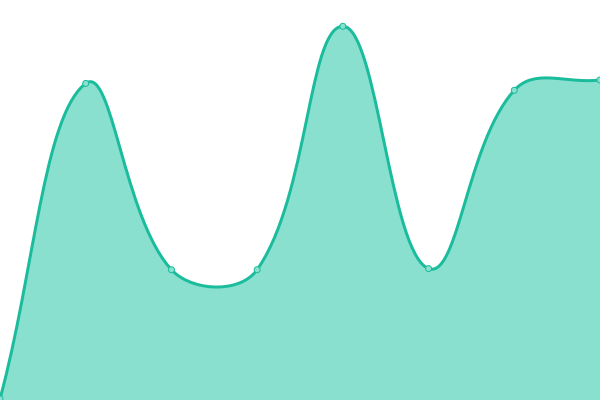
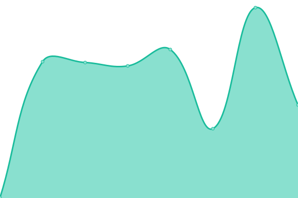
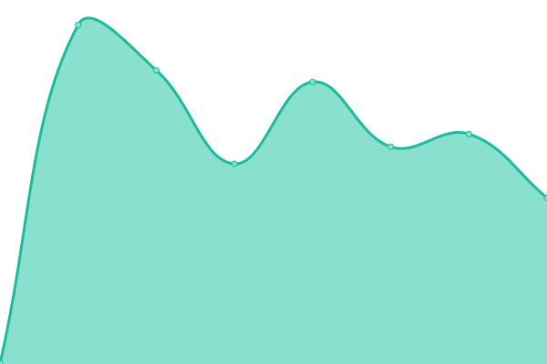
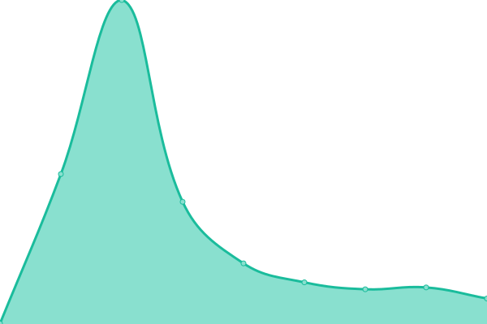

# [📈 Live Status](https://phantomic12.github.io/uptime-monitor): <!--live status--> **🟩 All systems operational**

This repository contains the open-source uptime monitor and status page for [phantomic12](https://phantomic12.github.io/uptime-monitor), powered by [Upptime](https://github.com/upptime/upptime).

With [Upptime](https://upptime.js.org), you can get your own unlimited and free uptime monitor and status page, powered entirely by a GitHub repository. We use [Issues](https://github.com/phantomic12/uptime-monitor/issues) as incident reports, [Actions](https://github.com/phantomic12/uptime-monitor/actions) as uptime monitors, and [Pages](https://phantomic12.github.io/uptime-monitor) for the status page.

<!--start: status pages-->
<!-- This summary is generated by Upptime (https://github.com/upptime/upptime) -->
<!-- Do not edit this manually, your changes will be overwritten -->
<!-- prettier-ignore -->
| URL | Status | History | Response Time | Uptime |
| --- | ------ | ------- | ------------- | ------ |
|  [ptero panel](https://panel.phantomic.live) | 🟩 Up | [ptero-panel.yml](https://github.com/phantomic12/uptime-monitor/commits/HEAD/history/ptero-panel.yml) | 

 619ms
     
 | 

<a href="https://uptime.phantomic.live/history/ptero-panel">98.89%</a>
    

|  [rainbow-main portainer](https://portainer-rainbow.phantomic.live) | 🟩 Up | [rainbow-main-portainer.yml](https://github.com/phantomic12/uptime-monitor/commits/HEAD/history/rainbow-main-portainer.yml) | 

 394ms
     
 | 

<a href="https://uptime.phantomic.live/history/rainbow-main-portainer">98.80%</a>
    

|  [media server](https://media.phantomic.vip) | 🟩 Up | [media-server.yml](https://github.com/phantomic12/uptime-monitor/commits/HEAD/history/media-server.yml) | 

 377ms
     
 | 

<a href="https://uptime.phantomic.live/history/media-server">100.00%</a>
    

|  [jellyseerr](https://jellyseerr.phantomic.live) | 🟩 Up | [jellyseerr.yml](https://github.com/phantomic12/uptime-monitor/commits/HEAD/history/jellyseerr.yml) | 

 487ms
     
 | 

<a href="https://uptime.phantomic.live/history/jellyseerr">98.64%</a>
    

|  [immich-main](https://immich-87.phantomic.vip) | 🟩 Up | [immich-main.yml](https://github.com/phantomic12/uptime-monitor/commits/HEAD/history/immich-main.yml) | 

 264ms
     
 | 

<a href="https://uptime.phantomic.live/history/immich-main">100.00%</a>
    

|  [immich-family](https://immich-ti.phantomic.vip) | 🟩 Up | [immich-family.yml](https://github.com/phantomic12/uptime-monitor/commits/HEAD/history/immich-family.yml) | 

 267ms
     
 | 

<a href="https://uptime.phantomic.live/history/immich-family">100.00%</a>
    

|  [2fauth](https://2fauth.phantomic.live) | 🟩 Up | [2fauth.yml](https://github.com/phantomic12/uptime-monitor/commits/HEAD/history/2fauth.yml) | 

 385ms
     
 | 

<a href="https://uptime.phantomic.live/history/2fauth">98.97%</a>
    

|  [ptero panel portainer](https://portainer.phantomic.live/) | 🟩 Up | [ptero-panel-portainer.yml](https://github.com/phantomic12/uptime-monitor/commits/HEAD/history/ptero-panel-portainer.yml) | 

 283ms
     
 | 

<a href="https://uptime.phantomic.live/history/ptero-panel-portainer">98.66%</a>
    

|  [oracle cloud node portainer](https://portainer3.phantomic.live/) | 🟩 Up | [oracle-cloud-node-portainer.yml](https://github.com/phantomic12/uptime-monitor/commits/HEAD/history/oracle-cloud-node-portainer.yml) | 

 223ms
     
 | 

<a href="https://uptime.phantomic.live/history/oracle-cloud-node-portainer">98.97%</a>
    

|  [sunshroom-portainer](https://portainer-sunshroom.phantomic.live/) | 🟩 Up | [sunshroom-portainer.yml](https://github.com/phantomic12/uptime-monitor/commits/HEAD/history/sunshroom-portainer.yml) | 

 301ms
     
 | 

<a href="https://uptime.phantomic.live/history/sunshroom-portainer">98.63%</a>
    

<!--end: status pages-->

[**Visit our status website →**](https://phantomic12.github.io/uptime-monitor)

## 📄 License

- Powered by: [Upptime](https://github.com/upptime/upptime)
- Code: [MIT](./LICENSE) © [phantomic12](https://phantomic12.github.io/uptime-monitor)
- Data in the `./history` directory: [Open Database License](https://opendatacommons.org/licenses/odbl/1-0/)
