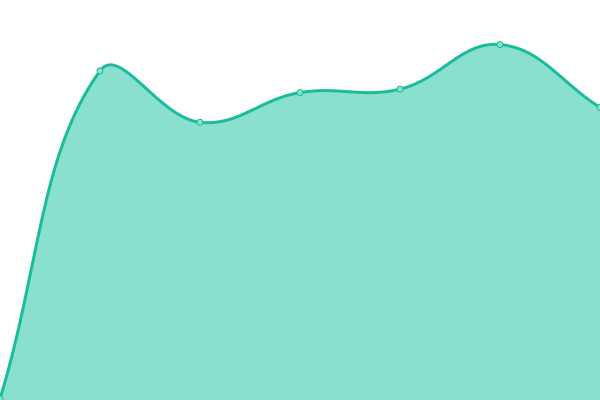
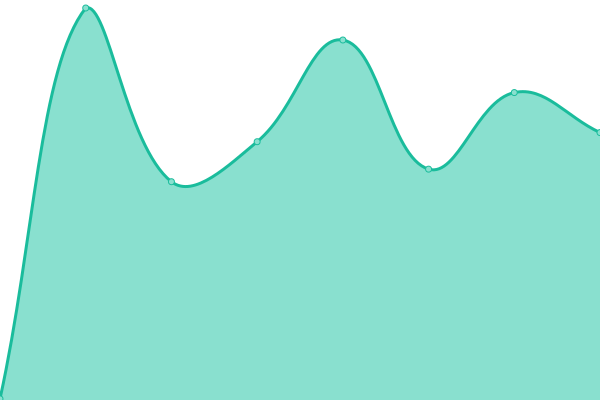

# [📈 Live Status](https://phantomic12.github.io/uptime-monitor): <!--live status--> **🟥 Complete outage**

This repository contains the open-source uptime monitor and status page for [phantomic12](https://phantomic12.github.io/uptime-monitor), powered by [Upptime](https://github.com/upptime/upptime).

With [Upptime](https://upptime.js.org), you can get your own unlimited and free uptime monitor and status page, powered entirely by a GitHub repository. We use [Issues](https://github.com/phantomic12/uptime-monitor/issues) as incident reports, [Actions](https://github.com/phantomic12/uptime-monitor/actions) as uptime monitors, and [Pages](https://phantomic12.github.io/uptime-monitor) for the status page.

<!--start: status pages-->
<!-- This summary is generated by Upptime (https://github.com/upptime/upptime) -->
<!-- Do not edit this manually, your changes will be overwritten -->
<!-- prettier-ignore -->
| URL | Status | History | Response Time | Uptime |
| --- | ------ | ------- | ------------- | ------ |
|  [Main redbot instance](https://redbot-gnome-phantomic12.cloud.okteto.net/) | 🟥 Down | [main-redbot-instance.yml](https://github.com/phantomic12/uptime-monitor/commits/HEAD/history/main-redbot-instance.yml) | 

 238ms
     
 | 

<a href="https://phantomic12.github.io/uptime-monitor/history/main-redbot-instance">0.00%</a>
    

|  [Secondary redbot instance](https://redbot-nick-phantomic12.cloud.okteto.net/) | 🟥 Down | [secondary-redbot-instance.yml](https://github.com/phantomic12/uptime-monitor/commits/HEAD/history/secondary-redbot-instance.yml) | 

 245ms
     
 | 

<a href="https://phantomic12.github.io/uptime-monitor/history/secondary-redbot-instance">0.00%</a>
    

|  [Main musicbot instance](https://discord-musicbot-gnome-phantomic12.cloud.okteto.net/) | 🟥 Down | [main-musicbot-instance.yml](https://github.com/phantomic12/uptime-monitor/commits/HEAD/history/main-musicbot-instance.yml) | 

 246ms
     
 | 

<a href="https://phantomic12.github.io/uptime-monitor/history/main-musicbot-instance">98.73%</a>
    

|  [Secondary musicbot instance](https://discord-musicbot-on-phantomic12.cloud.okteto.net/) | 🟥 Down | [secondary-musicbot-instance.yml](https://github.com/phantomic12/uptime-monitor/commits/HEAD/history/secondary-musicbot-instance.yml) | 

 930ms
     
 | 

<a href="https://phantomic12.github.io/uptime-monitor/history/secondary-musicbot-instance">98.62%</a>
    

|  [Main lavalink instance](https://lavalink-phantomic12.cloud.okteto.net/) | 🟥 Down | [main-lavalink-instance.yml](https://github.com/phantomic12/uptime-monitor/commits/HEAD/history/main-lavalink-instance.yml) | 

 188ms
     
 | 

<a href="https://phantomic12.github.io/uptime-monitor/history/main-lavalink-instance">0.00%</a>
    

|  [code-server](https://code-server-phantomic12.cloud.okteto.net/) | 🟥 Down | [code-server.yml](https://github.com/phantomic12/uptime-monitor/commits/HEAD/history/code-server.yml) | 

 257ms
     
 | 

<a href="https://phantomic12.github.io/uptime-monitor/history/code-server">0.00%</a>
    

|  [egglord](https://egglord-phantomic12.cloud.okteto.net/) | 🟥 Down | [egglord.yml](https://github.com/phantomic12/uptime-monitor/commits/HEAD/history/egglord.yml) | 

 260ms
     
 | 

<a href="https://phantomic12.github.io/uptime-monitor/history/egglord">0.00%</a>
    

<!--end: status pages-->

[**Visit our status website →**](https://phantomic12.github.io/uptime-monitor)

## 📄 License

- Powered by: [Upptime](https://github.com/upptime/upptime)
- Code: [MIT](./LICENSE) © [phantomic12](https://phantomic12.github.io/uptime-monitor)
- Data in the `./history` directory: [Open Database License](https://opendatacommons.org/licenses/odbl/1-0/)
