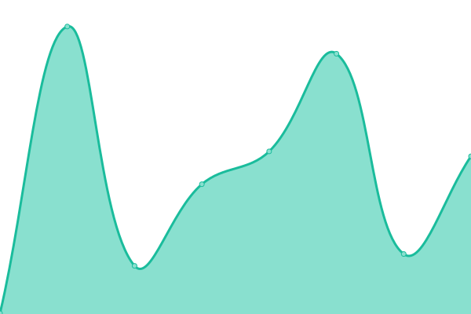

# [📈 Live Status](https://phantomic12.github.io/uptime-monitor): <!--live status--> **🟧 Partial outage**

This repository contains the open-source uptime monitor and status page for [phantomic12](https://phantomic12.github.io/uptime-monitor), powered by [Upptime](https://github.com/upptime/upptime).

With [Upptime](https://upptime.js.org), you can get your own unlimited and free uptime monitor and status page, powered entirely by a GitHub repository. We use [Issues](https://github.com/phantomic12/uptime-monitor/issues) as incident reports, [Actions](https://github.com/phantomic12/uptime-monitor/actions) as uptime monitors, and [Pages](https://phantomic12.github.io/uptime-monitor) for the status page.

<!--start: status pages-->
<!-- This summary is generated by Upptime (https://github.com/upptime/upptime) -->
<!-- Do not edit this manually, your changes will be overwritten -->
<!-- prettier-ignore -->
| URL | Status | History | Response Time | Uptime |
| --- | ------ | ------- | ------------- | ------ |
|  [ptero panel](https://panel.phantomic.live) | 🟩 Up | [ptero-panel.yml](https://github.com/phantomic12/uptime-monitor/commits/HEAD/history/ptero-panel.yml) | 

 607ms
     
 | 

<a href="https://uptime.phantomic.live/history/ptero-panel">100.00%</a>
    

|  [replit index](https://onemanager-php.phantomic12.repl.co/) | 🟩 Up | [replit-index.yml](https://github.com/phantomic12/uptime-monitor/commits/HEAD/history/replit-index.yml) | 

 1022ms
     
 | 

<a href="https://uptime.phantomic.live/history/replit-index">100.00%</a>
    

|  [vercel index](https://onemanager-1-six.vercel.app/) | 🟩 Up | [vercel-index.yml](https://github.com/phantomic12/uptime-monitor/commits/HEAD/history/vercel-index.yml) | 

 1647ms
     
 | 

<a href="https://uptime.phantomic.live/history/vercel-index">100.00%</a>
    

|  [proxy index](https://index.phantomic.live/) | 🟩 Up | [proxy-index.yml](https://github.com/phantomic12/uptime-monitor/commits/HEAD/history/proxy-index.yml) | 

 616ms
     
 | 

<a href="https://uptime.phantomic.live/history/proxy-index">100.00%</a>
    

|  [ptero panel portainer](https://portainer.phantomic.live/) | 🟩 Up | [ptero-panel-portainer.yml](https://github.com/phantomic12/uptime-monitor/commits/HEAD/history/ptero-panel-portainer.yml) | 

 235ms
     
 | 

<a href="https://uptime.phantomic.live/history/ptero-panel-portainer">100.00%</a>
    

|  [oracle cloud node portainer](https://portainer3.phantomic.live/) | 🟩 Up | [oracle-cloud-node-portainer.yml](https://github.com/phantomic12/uptime-monitor/commits/HEAD/history/oracle-cloud-node-portainer.yml) | 

 164ms
     
 | 

<a href="https://uptime.phantomic.live/history/oracle-cloud-node-portainer">100.00%</a>
    

|  [code-server](https://code-server-phantomic12.cloud.okteto.net/) | 🟥 Down | [code-server.yml](https://github.com/phantomic12/uptime-monitor/commits/HEAD/history/code-server.yml) | 

 0ms
     
 | 

<a href="https://uptime.phantomic.live/history/code-server">0.00%</a>
    

<!--end: status pages-->

[**Visit our status website →**](https://phantomic12.github.io/uptime-monitor)

## 📄 License

- Powered by: [Upptime](https://github.com/upptime/upptime)
- Code: [MIT](./LICENSE) © [phantomic12](https://phantomic12.github.io/uptime-monitor)
- Data in the `./history` directory: [Open Database License](https://opendatacommons.org/licenses/odbl/1-0/)
